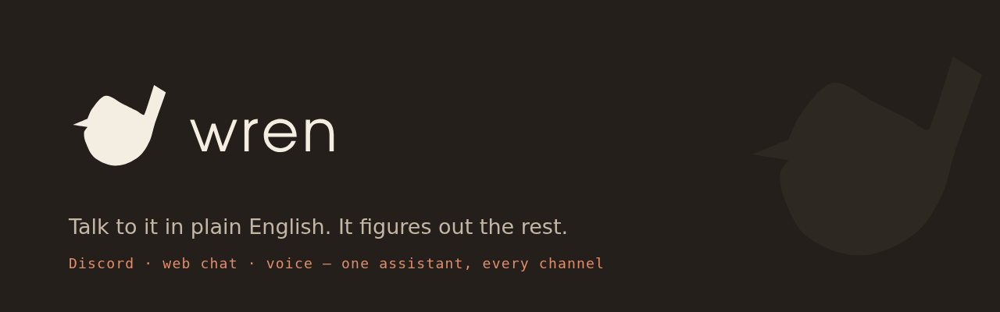
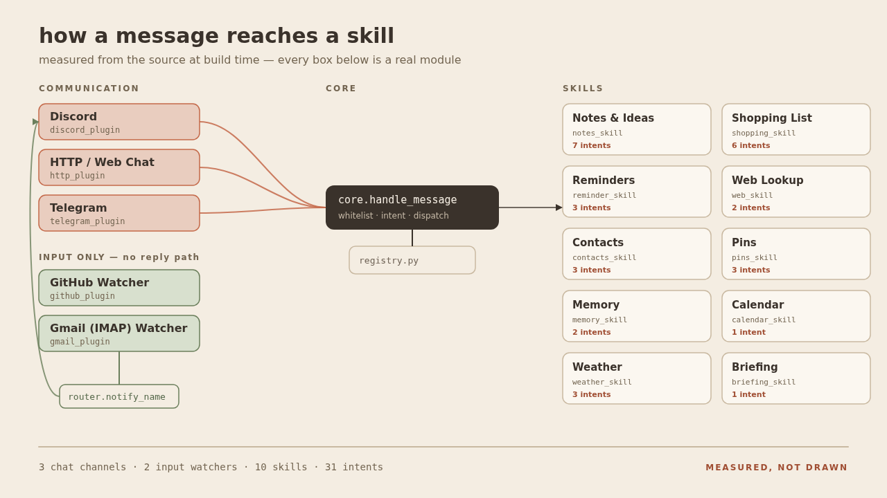

<p align="center">
  
</p>

<p align="center">
  <strong>A private, self-hosted assistant for your household.</strong><br>
  <em>local-first · plugin channels · drop-in skills</em>
</p>

---

Talk to Wren in plain English and it works out the intent — save a note, manage
a shared shopping list, capture an idea, set a reminder, search the web,
message someone else on the whitelist, or just chat.

Wren is transport-agnostic. It is built from two kinds of plugin:
**Communication** plugins (Discord, Telegram, HTTP/web chat, Gmail, GitHub) are
how you reach Wren and how Wren reaches you; **Skills** (Shopping List, Notes,
Reminders, Pins, Contacts, Web) are what Wren can actually do — usable through
any Communication plugin you enable. Discord is one Communication plugin, not a
requirement: run Wren with Discord alone, with the local HTTP API alone (for the
desktop voice client or the browser chat window), or several at once.

It runs on your hardware and your data stays home. That is a statement about
where it runs, not a security guarantee — see [Security](#security-expectations)
for what that does and does not buy you.

## Setup

1. `python3 -m venv venv && source venv/bin/activate`
2. `pip install -r requirements.txt`
3. `cp .env.example .env` and fill in:
   - `WREN_OWNER_ID` — required, and not a setting of any one chat plugin.
     Everything you save is filed under it, so changing it later orphans the
     lot. Reuse the user id of whichever chat plugin you set up first; to add a
     second plugin, map its id onto this one rather than changing it.
   - `COMMUNICATION_PLUGINS` — comma-separated, default `discord`. See
     [Communication plugins](#communication-plugins).
   - `DISCORD_TOKEN` — required *only* if `COMMUNICATION_PLUGINS` includes `discord`.
   - `LLM_PROVIDERS` — an ordered, comma-separated list of LLM providers to
     try (see below). At least one must resolve or Wren refuses to start.
   - `TIMEZONE` — optional, default UTC. Set to your IANA timezone (e.g.
     `America/Chicago`) so reminder times like "9am" are interpreted
     correctly.
   - Everything else in `.env.example` is optional.
4. Discord only: in the [Discord Developer Portal](https://discord.com/developers/applications/),
   select your bot application → **Bot** tab → under **Privileged Gateway
   Intents**, enable **MESSAGE CONTENT INTENT** and save. Wren reads DM text
   to detect intent, and Discord treats that as a privileged intent that
   must be turned on here — without it, the bot crashes on startup with
   `discord.errors.PrivilegedIntentsRequired`.
5. `python3 -m wren.run`

Alternatively, run `./setup.sh` for an interactive walkthrough that does all
of the above except the Developer Portal step (that one's manual, Discord
doesn't expose it via API) plus optional systemd install.

Whichever channel you use, Wren only answers whitelisted users (`owner`, plus
any contacts added at runtime). Everything else is ignored.

## Communication plugins

A Communication plugin is how you reach Wren, or how Wren reaches you. Skills
(notes, reminders, shopping, …) work identically across every chat-capable one.

Each Communication plugin declares a `ROLE`:
- **`chat`** — full input + output, a real conversational surface
  (`discord`, `telegram`, `http`)
- **`input`** — one-way event source; watches something external and calls
  `router.notify_name(...)` to hand off to a `chat` plugin (`gmail`, `github`)

### `discord` — role: chat

DM the bot. Requires `DISCORD_TOKEN`. Discord and the web chat are the two
channels with conversation history, so multi-turn follow-ups ("what did I just
say") resolve here.

### `telegram` — role: chat

DM the bot on Telegram. Requires `TELEGRAM_TOKEN` from
[@BotFather](https://t.me/botfather) and `TELEGRAM_OWNER_ID`, your Telegram
user id (ask [@userinfobot](https://t.me/userinfobot)).

User ids are per-surface: the number Telegram calls you is not the number
Discord calls you, and Wren keys the whitelist and every note, reminder and pin
off one id per person. `TELEGRAM_OWNER_ID` is what translates the two, so
adding Telegram to an install that already has Discord gives you a second door
into the same Wren rather than a second, empty one. Unset it only on a
Telegram-first install, where `WREN_OWNER_ID` is already the Telegram id. Anyone
else is a plain contact ("add 123456789 as phone").

Long-polls `getUpdates` over `aiohttp`; there is no Telegram client library in
the dependency list. Private chats only — group messages are ignored. The Bot
API gives a bot no way to read a chat's backlog, so `history` is `None` and
follow-ups that depend on the previous turn won't resolve here.

### `http` — role: chat (send-only for proactive notifications)

A local HTTP API plus the browser chat UI. Set
`WREN_TOKENS=<token>:<user_id>` (generate with `openssl rand -hex 24`), then
open `http://<wren-host>:8787/` and paste that token once — it is kept in
`localStorage` after that. See [Web chat](#web-chat).

### `gmail` — role: input only

Watches an IMAP inbox and notifies a `chat` plugin when mail arrives from
someone on your whitelist. See [Gmail-arrival watcher](#gmail-arrival-watcher-optional).
Never talks back directly — it has no "send" of its own.

### `github` — role: input only

Watches repo activity and notifies a `chat` plugin. See
[GitHub watcher](#github-repo-activity-watcher-optional). Also input-only.

The machine API, used by the desktop voice client:

| Route | Body | Returns |
|---|---|---|
| `GET /health` | — | `{"ok": true}` |
| `POST /message` | `{"text": "..."}` | `{"replies": [...], "files": [...]}` |
| `POST /voice` | raw WAV bytes | `{"transcript": "...", "replies": [...]}` |

All routes but `/health` need `Authorization: Bearer <token>`. Files come
back base64-encoded.

```bash
curl -s localhost:8787/message \
  -H "Authorization: Bearer $WREN_TOKEN" \
  -H 'Content-Type: application/json' \
  -d '{"text":"add potatoes to shopping"}'
```

It binds `127.0.0.1` by default, and Wren serves plain HTTP with no TLS of its
own. Setting `WREN_HTTP_HOST=0.0.0.0` to reach it from other machines therefore
puts the bearer token — the only thing guarding your notes and shopping list —
on the wire in clear text, readable by anything on the network.

**The better shape is to leave the binding at `127.0.0.1` and put a TLS
reverse proxy in front.** Wren stays unreachable from the network, the proxy
terminates TLS, and the token never travels unencrypted. A minimal nginx
server block:

```nginx
server {
    listen 192.168.1.10:8444 ssl;      # your LAN address, NOT 0.0.0.0
    ssl_certificate     /etc/nginx/certs/wren.crt;
    ssl_certificate_key /etc/nginx/certs/wren.key;
    client_max_body_size 25m;          # matches Wren's own cap, for /voice

    location / {
        proxy_pass http://127.0.0.1:8787;
        proxy_set_header Host $host;
        proxy_set_header X-Real-IP $remote_addr;
        proxy_read_timeout 300;        # an LLM reply is slow and not streamed
    }
}
```

Bind the listener to your LAN address explicitly rather than `0.0.0.0`. A host
with a public IPv6 address is internet-reachable on every interface it listens
on, and `0.0.0.0`/`[::]` will happily publish your household assistant. A
self-signed certificate is fine here and avoids the trap of a publicly
resolvable name: your browser asks once, and reaching a public hostname would
route over the internet rather than the LAN anyway.

Note the page uses absolute paths (`/api/conversations`), so it must be proxied
at a server root — a subpath like `/wren/` needs URL rewriting.

**The http plugin is send-only.** It has no way to push, so
`NOTIFY_VIA=http` cannot deliver reminders — it logs and drops them.
Point `NOTIFY_VIA` at `discord` or `telegram` if you want reminders to reach you.

## Web chat

`COMMUNICATION_PLUGINS=http` also serves a chat page at `/` — a sidebar of conversations,
markdown replies, the whole assistant behind it. Say "add potatoes to
shopping" there and it goes on the same list Discord sees.

Open `http://<wren-host>:8787/`, paste a `WREN_TOKENS` value once, and it is
remembered per browser. The page itself is served without auth because it is a
static shell holding no user data; every request it makes carries the token.

**This is the only channel besides Discord with conversation history.** Voice,
Telegram and the machine API are one-shot by design. Chat history lives in
Wren's own `conversations`/`messages` tables, so it follows you between machines.

Conversations are per-user: a token maps to a user id, and one user cannot see
or touch another's conversations.

| Route | Body | Returns |
|---|---|---|
| `GET /` | — | the chat page |
| `GET /api/conversations` | — | `[{id, title, updated_at}]` |
| `POST /api/conversations` | — | `{id, title}` |
| `GET /api/conversations/{id}` | — | `{id, title, messages}` |
| `PATCH /api/conversations/{id}` | `{title}` | rename |
| `DELETE /api/conversations/{id}` | — | delete it and its messages |
| `POST /api/conversations/{id}/message` | `{text}` | `{replies, files}` |
| `GET /api/me` | — | `{name, skills, model}` — any whitelisted user |
| `GET /api/models` | — | `{provider, current, models, reason}` — owner only |
| `GET /api/plugins` | — | `{skills, channels, settings}` — owner only |
| `PATCH /api/plugins/{module}` | `{enabled}` | toggle a skill — owner only |
| `PATCH /api/settings` | `{KEY: value}` | change a non-secret setting — owner only |

Titles come from the first message and can be renamed. Replies are **not**
streamed — `brain` returns a finished string and intent detection has to
happen first, so you get a thinking indicator rather than tokens appearing.
That is the main thing that will feel different from claude.ai.

### The landing screen

Opening the chat greets you by name, shows a pill per enabled skill that drops
a starter phrase into the composer, and — if you are the owner — lets you pick
which model answers. Not every skill gets a pill: Contacts is owner-only
administration, not something to invite a household member into, so it has no
starter phrase and renders nothing here.

Set your name with `OWNER_NAME` in the plugins panel (below). Until it is set
the greeting is just the time of day: the whitelist alias for the owner is the
literal string `owner`, and being greeted as "owner" is worse than not being
greeted by name. Contacts are greeted by their own alias.

Changing the model rewrites the active provider's `*_MODEL` setting and
rebuilds the provider chain, so it applies everywhere Wren answers — Discord
and reminders included — and survives a restart. Wren has one engine; there
is no web-chat-only model. The selector only ever lists models for whichever
provider is currently active; it cannot switch you to a different provider,
only to a different model of the one already in use. The model list comes
from the provider itself; if it is unreachable, or you are not the owner, the
selector falls back to showing the current model as text.

### The plugins panel

The gear beside "New" opens an owner-only panel: every skill and channel with
the reason any of them is inactive, switches for the skills, and the settings
that are not credentials.

Credentials are deliberately absent. The bearer token buys a chat window; it
must not also buy `DISCORD_TOKEN`. `GET /api/plugins` returns setting VALUES,
and that is safe only because `config.SETTABLE` — the allowlist of what this
endpoint can even see — holds no credentials. Those two facts stand or fall
together: never add a secret to `SETTABLE`.

Channels are read-only status, not toggles. `COMMUNICATION_PLUGINS` is read
once at startup, so enabling Telegram is still two lines in `.env` and a
restart — a toggle here would be a dead control, and the endpoint refuses a
channel PATCH with a 400 rather than pretend one would work.

Unlike the landing screen's own model selector (above, scoped to the one
active provider), the settings list here shows all five `*_MODEL` fields —
`GET /api/plugins` lists every key in `config.SETTABLE` unconditionally, not
just the providers `LLM_PROVIDERS` actually names. Typing a model into a
provider already named in `LLM_PROVIDERS` that had none configured genuinely
revives it into the fallback chain. Typing one into a provider that was never
named in `LLM_PROVIDERS` does not: `reload_llm_chain()` only re-resolves the
providers captured from `LLM_PROVIDERS` at import, so that provider is never
even attempted — and the field still returns a 200, silently doing nothing.
`LLM_PROVIDERS` itself is `.env`-only and needs a restart to change; this
panel cannot substitute for it.

Switching a skill off does not undo what it already did. Reminders keeps
firing what you already scheduled even with the skill switched off in this
panel: `registry.start_all()` starts every skill's background task
unconditionally, and the enable flag only gates the *dispatch* of chat
intents in `core.py`. Turning Reminders off stops Wren from offering to set
new ones — it does not pause the poller already delivering the old ones.
This looks like a bug and is not.

Settings changes apply immediately (`config.apply_overrides()` writes onto
`config`'s own globals, which every consumer reads at call time) and persist
in a `settings` table that overrides `.env`. Wren never writes to `.env`.

The panel itself is owner-only: the gear stays hidden for every other
whitelisted user, because the page probes `GET /api/plugins` on load and
only reveals the gear if that call succeeds — everyone else gets a 403 from
all three routes.

### Where notifications go

Replies always return to whichever communication plugin asked. *Unprompted*
messages — a reminder firing, a Gmail or GitHub watcher alert — go to a
single configured `NOTIFY_VIA`, defaulting to the first entry in
`COMMUNICATION_PLUGINS`. So you can set a reminder by voice from a laptop
and have it ping you on Discord.

## Voice (optional)

Hold a global hotkey on any machine on your LAN, talk, release. Audio is
transcribed **on the Wren host** — it never leaves your network.

On the Wren host:

```bash
pip install faster-whisper       # without this, /voice returns 503
# .env: COMMUNICATION_PLUGINS=discord,http  +  WREN_TOKENS=...  +  WREN_HTTP_HOST=0.0.0.0
```

On each desktop (Windows, macOS, or Linux):

```bash
pip install -r client/requirements.txt
WREN_URL=http://wren-host:8787 WREN_TOKEN=<token> python client/wren_hotkey.py
```

Hold **F9** (override with `WREN_HOTKEY`) to record, release to send. The
reply arrives as a native desktop notification. Linux also needs PortAudio
(`apt install libportaudio2`).

Tune `WREN_STT_MODEL` (`tiny.en` → `large-v3`) and `WREN_STT_DEVICE` /
`WREN_STT_COMPUTE` to your hardware — the defaults (`base.en`, `auto`,
`int8`) are chosen to stay usable on a CPU-only host.

Voice requests are one-shot: channels without conversation history can't
resolve follow-ups that depend on the previous turn.

## LLM providers and fallback

Wren talks to an LLM for intent detection and replies. Supported providers:
`lmstudio` (or any local/self-hosted OpenAI-compatible server), `ollama`,
`openai`, `claude` (via Anthropic's OpenAI-compatible endpoint),
`openrouter`. Set `LLM_PROVIDERS=lmstudio,openai` (priority order) and the
matching `*_BASE_URL`/`*_API_KEY`/`*_MODEL` env vars for whichever providers
you list — see `.env.example` for the exact variable names per provider.

If a provider fails an LLM call (any exception — timeout, bad response,
connection refused), Wren logs a warning and falls through to the next
provider in the list. If every provider in the chain fails, the request
fails too — this is a liveness fallback across endpoints, not a
retry/backoff mechanism.

**Model choice (local models via `lmstudio`/`ollama`):** use a plain
instruct model, not a "thinking"/reasoning model. Reasoning models (e.g.
Qwen3's default thinking mode) emit long chain-of-thought before answering
and can churn for a very long time on even a simple message — bad fit for
fast intent classification + short replies. `brain.py` sets `max_tokens` and
adds a `/no_think` hint as a safety net, but the model itself matters more.
Known-good, tested here: [`Qwen2.5-7B-Instruct-GGUF`](https://huggingface.co/lmstudio-community/Qwen2.5-7B-Instruct-GGUF)
(not Qwen3) — fast, follows JSON-schema instructions cleanly, no reasoning
overhead. `Llama-3.1-8B-Instruct` and `Mistral-7B-Instruct-v0.3` are solid
alternatives with the same profile.

## What you can say

**Notes**
- "remind me to call the plumber" → saves a note
- "what do I need to do" → recalls and answers from your notes

**Ideas** (separate from notes — for things to revisit or expand later)
- "remember this idea: build a treehouse"
- "what ideas have I saved"
- "discard the idea about the treehouse" — matches by a phrase, asks you to
  be more specific if it matches more than one
- "expand on the treehouse idea" — Wren elaborates via the LLM; nothing is
  saved back

**Reminders**
- "remind me to take out the trash at 6pm" / "in 20 minutes" / "tomorrow morning"
- "what are my reminders" — shows all upcoming reminders with times
- "cancel the trash reminder" — matches by phrase, asks for specifics if needed
- Times are interpreted in the configured `TIMEZONE` (default UTC) — set
  it in `.env` to your local zone.

**Shopping** (one shared list across the whole household)
- "add potatoes to shopping"
- "got the potatoes" / "remove potatoes from shopping"
- "what's on the shopping list" — also surfaces "you often get: ..."
  suggestions for items you've bought 3+ times before
- "send shopping to husband" — sends the whole current list to another
  whitelisted contact

**Messaging**
- "tell husband dinner's at 7" — messages the other whitelisted contact
- anything else falls through to open-ended chat

**Status**
- "show status" / "what backend are you using" / "show model" — reports the
  active LLM backend/model/endpoint, process uptime, and token usage since
  the last restart (resets on restart, not persisted)
- "list plugins" — every skill and watcher, and whether each is configured

**Memory**
- "what do you know about me" — lists facts Wren has picked up while talking
  with you
- "forget that I dislike cilantro" — matches by phrase, asks you to be more
  specific if it matches more than one

## Web lookup (optional)

Enable web search and page reading by setting `SEARXNG_URL` (and optionally
`FIRECRAWL_URL`) in `.env`. See `.env.example` for details.

Your SearXNG must expose its JSON API — add `json` to `search.formats` in its
`settings.yml` (not on by default) and, since its bot limiter 429s non-browser
callers, set `server.limiter: false` on a private LAN. Otherwise every search
just reports "Search is unavailable right now." Firecrawl works out of the box.

- "what's the weather in Chicago tomorrow" / "any news on the port strike" —
  searches the web and summarizes the results with links
- "read me the first one" / "read https://…" — fetches a page in full and
  summarizes it

## Calendar (optional)

Set `CALENDAR_URLS` in `.env` to one or more ICS feed URLs (comma-separated).
Every mainstream calendar exports one — in Google Calendar it is the "Secret
address in iCal format" under the calendar's settings. Treat it like a
password: it is managed with `manage.sh secret set CALENDAR_URLS …` and the
plugins panel only ever says whether it is set. The feed URL never appears in
the service log either — `wren/run.py` raises the `httpx` logger above INFO
specifically so its per-request line (which includes the full URL) is never
written to the journal; a failed fetch is logged with the feed's host only.

- "what's on my calendar" / "what does today look like"
- "anything tomorrow?" / "what's on Friday"
- "show my week"

Read-only: Wren never creates or edits events. Recurring events are expanded
for the day you asked about (daily/weekly/monthly/yearly, with weekday lists,
exceptions and moved instances); exotic rules like "second Monday" fall back
to the plain frequency.

## Weather (optional)

Set `WEATHER_LAT` and `WEATHER_LON` (decimal degrees) in `.env` or the
plugins panel. Forecasts come from Open-Meteo — no account, no key, and the
only thing sent is the coordinates.

- "what's the weather" — now, plus today's high, low and rain chance
- "will it rain tomorrow" — tomorrow's outlook

## Daily briefing (optional)

Ask "what's my day look like" any time, or set `BRIEFING_TIME` (e.g. `07:30`,
in your `TIMEZONE`) and Wren sends it unprompted every morning through
`NOTIFY_VIA`:

    Good morning. Wed Aug 26.
    Weather: 72°F and partly cloudy, wind 8 mph. High 81, low 63, 20% chance of rain.
    Calendar:
      09:00–09:30  Standup
      13:00–14:00  Dentist
    Reminders today:
      17:00  call the vet
    Shopping list: 6 items.

Sections that have nothing to say are left out. No model is involved — the
briefing is assembled from what the calendar, weather, reminders and shopping
skills already know, so it cannot invent an appointment. Switching any of
those skills off in the plugins panel drops its section.

## Memory

Wren picks up short facts about you as you talk — preferences, people,
projects, that kind of thing — and stores them per owner so it can bring
them up again later without being asked.

Extraction is a separate background pass, not something that happens on
your turn: a fast regex gate queues a turn that looks worth remembering,
and a periodic sweep (`MEMORY_SWEEP_SECONDS`, default 300) is what actually
calls the model to pull facts out of it. Nothing about answering you waits
on that call.

You can always list what's remembered ("what do you know about me") and
delete anything you don't want kept ("forget that I dislike cilantro").
There's no separate edit — forget it and say it again.

Switching Memory off in the web chat's plugins panel stops both halves: the
background sweep stops extracting new facts, and nothing already stored is
injected into future replies.

At INFO the service log records a short snippet of each queued turn and
every extracted fact (this is the tuning corpus); raise the log level to
suppress it — households with more than one person should know before
switching Memory on.

## Gmail-arrival watcher (optional)

Add `gmail` to `COMMUNICATION_PLUGINS`, set
`EMAIL_WATCH=alice@example.com:owner,bob@example.com:husband` plus
`IMAP_HOST`/`IMAP_USER`/`IMAP_PASSWORD` in `.env` and Wren polls that inbox
(every `EMAIL_POLL_SECONDS`, default 60) for unread mail from a listed
sender and notifies the mapped contact via `NOTIFY_VIA`. Leave `EMAIL_WATCH`
unset (or drop `gmail` from `COMMUNICATION_PLUGINS`) to disable — nothing
else about the bot depends on it. Despite the name this is plain IMAP, so
any provider works, Gmail included.

## GitHub repo activity watcher (optional)

Add `github` to `COMMUNICATION_PLUGINS` and set
`GITHUB_WATCH=owner/repo,owner/repo2` in `.env`. Wren polls each repo (every
`GITHUB_POLL_SECONDS`, default 60) and notifies you via `NOTIFY_VIA` when the
star count rises or a new issue or pull request appears.

`GITHUB_TOKEN` is optional: without it you get anonymous rate limits and public
repos only; with it, private repos work and the limit rises to 5000 requests an
hour. Seen events are recorded in `github_state` so a restart doesn't re-announce
everything. Leave `GITHUB_WATCH` unset to disable.

## Architecture



That figure is generated, not drawn — `Brand/src/gen_arch.py` parses
`wren/registry.py` and `wren/communication/` with `ast` and the picture is
rendered from what it finds. If it disagrees with the code, the figure is the
thing that's wrong; regenerate it (see [Brand and logo usage](#brand-and-logo-usage)).

All source lives in the `wren/` package (run as `python3 -m wren.run`). See
[PROJECT_PLAN.md](PROJECT_PLAN.md) for the fuller rationale behind this split.

There are **two** plugin classes, on different axes:

- **`wren/skills/`** — *what Wren can do*. Shopping List, Notes, Reminders,
  Web, Pins, Contacts. None of them import `discord`, `aiohttp`, or anything
  transport-specific — they only ever see a `Channel`.
- **`wren/communication/`** — *how you reach Wren, and how Wren reaches you*.
  Discord, Telegram, HTTP/web chat (all `ROLE = "chat"`: input + output),
  Gmail, GitHub (both `ROLE = "input"`: watch something external, never receive
  a reply — they hand off through `router.notify_name(...)` to whichever chat
  plugin `NOTIFY_VIA` points at).

```
you ──▶ communication plugin ──▶ core.handle_message ──▶ skill
         (authn)                 (authz, intent)          (writes back via ctx.channel)

external event ──▶ communication plugin (input-only) ──▶ router.notify_name ──▶ communication plugin (chat)
   (new email,        (gmail_plugin.py,                                            (discord_plugin.py, ...)
    repo push)          github_plugin.py)
```

- `wren/run.py` — entrypoint. Initialises storage, starts each communication
  plugin named in `COMMUNICATION_PLUGINS`, starts every skill's background task.
- `wren/core.py` — transport-free dispatch: whitelist gate, intent detection,
  routing to whichever skill owns the intent, plus `help`/`status`/
  `list_plugins`/`send_to_person`/`chat`.
- `wren/channel.py` — the `Channel` protocol (`send`, `send_file`, `history`,
  `ack`), the `Ctx` dataclass handed to skills, and `CollectingChannel`
  (accumulates output; used by the HTTP plugin and by every skill's tests).
- `wren/router.py` — communication-plugin registry and `notify(user_id, text)`
  for unprompted messages, dispatched to `NOTIFY_VIA`.
- `wren/communication/discord_plugin.py` — Discord client, `DiscordChannel`
  (reactions implement `ack`, channel history implements `history`). `ROLE = "chat"`.
- `wren/communication/telegram_plugin.py` — Telegram bot, `TelegramChannel`
  (typing indicator implements `ack`; `history` is `None` — the Bot API gives
  a bot no way to read a chat's backlog). Long-polls `getUpdates` over aiohttp,
  no Telegram library, and translates the owner's Telegram id to their Wren id
  in both directions (`TELEGRAM_OWNER_ID`). `ROLE = "chat"`. Not enabled unless
  `TELEGRAM_TOKEN` is set and "telegram" is in `COMMUNICATION_PLUGINS`.
- `wren/communication/http_plugin.py` + `webchat.py` — aiohttp app, bearer-token
  auth, and the browser chat UI (conversations with real history). `ROLE = "chat"`.
- `wren/communication/gmail_plugin.py` — IMAP inbox watcher. `ROLE = "input"`.
- `wren/communication/github_plugin.py` (+ `github_state.py`) — repo activity
  watcher. `ROLE = "input"`.
- `wren/brain.py` — LLM intent detection (`detect_intent`), the fallback
  chain across providers (`_complete`), and one-off LLM calls used by
  skills (`recall`, `expand`, `chat`).
- `wren/config.py` / `wren/providers.py` — env-driven configuration.
- `wren/db.py` — one connection helper; `WREN_DB` sets the path.
- `wren/skills/notes_store.py` / `shopping_store.py` / `reminders_store.py` /
  `wren/contacts.py` / `wren/skills/pins_store.py` — SQLite storage. Notes,
  reminders and pins are per-owner; the shopping list is one shared table
  with no owner scoping.
- `wren/skills/*_skill.py` — Skills: intent names, the LLM prompt guideline
  text for them, and an async `handle(intent, ctx)`.
- `wren/stt.py` — speech-to-text, lazily loaded and entirely optional.
- `wren/registry.py` — the Skills registry: builds the combined intent list
  and prompt text `brain.py` needs, dispatches intents, and starts each
  skill's optional background task exactly once per process. `PLUGINS` holds
  Skills only; the Gmail and GitHub watchers live in `WATCHERS`, which
  `plugin_status()` also reports so "list plugins" can mention them, but which
  is deliberately absent from intent dispatch.

Adding a Skill: write a module in `wren/skills/` exposing `INTENTS`,
`PROMPT_GUIDELINES`, and `async handle(intent, ctx)`, then add it to
`registry.py`'s `PLUGINS` list. Write output with `await ctx.channel.send(...)`
— never import `discord`/`aiohttp`, or the skill stops working on every other
communication plugin. An event-only skill (background task, no user commands)
only needs an optional `async start()`, and should use `router.notify(...)`
to reach a user.

Adding a Communication plugin: create `wren/communication/<name>_plugin.py`
exposing a module-level `ROLE` (`"chat"` or `"input"`), `PLUGIN_NAME`, and —
for `"chat"` — `async start()` plus a `Channel` implementation; for
`"input"`, just `async start()` that polls/watches and calls
`router.notify_name(...)`. Register with `router.register(name, module)` in
`start()` if it can deliver unprompted messages. Add the name to
`COMMUNICATION_PLUGINS` in `.env` to enable it.

`telegram_plugin.py` is the worked example: adding an entire new chat channel
touched **zero** files under `wren/skills/`. If a new channel ever forces a
change to a skill, the abstraction has sprung a leak — add the capability to
the `Channel` protocol instead.

### Note on upgrading

Pins used to use Discord's own pin feature and had no storage of their own;
they now live in a `pins` table so they work on every channel. Existing
Discord pins are **not** migrated — they remain visible in Discord's pin list,
but need re-pinning through Wren to show up in `what's pinned`.

## Brand and logo usage

The full brand system — marks, reduction ladder, clear space, palette with live
WCAG contrast checks, type scale, do/don't — is one self-contained page:
open [`Brand/brand-system.html`](Brand/brand-system.html) in a browser. No build
step, no webfonts, no network requests. `Brand/README.md` covers the pipeline.

### The mark

A wren: compact body, fine beak, and the short tail cocked up over the back.
**The tail is the identity** — it is the one feature separating this from a
generic songbird, so it survives every reduction. Don't crop it, don't rotate
the bird, don't redraw it.

| Asset | Use |
|---|---|
| `Brand/brand/lockup.svg` | Mark + wordmark. The default. `-cream` and `-stacked` variants alongside. |
| `Brand/brand/mark.svg` | Mark alone — full detail: wing, eye, pale supercilium. `-cream`, `-bark`, `-badge` variants. |
| `Brand/brand/mark-simple.svg` | One colour, silhouette only. **Anything under ~24 px.** |
| `Brand/brand/wordmark.svg` | Type alone. `-cream`, `-clay` variants. |
| `Brand/brand/avatar-512.svg` | Profile pictures. `-clay` where it needs to pop, `-bark` on dark. |
| `Brand/favicon/` | The favicon ladder, `site.webmanifest`, and a `<head>` snippet to paste. |

**Reduction.** The full mark's wing, eye and supercilium stop resolving below
roughly 24 px and start reading as dirt. Use `mark-simple.svg` below that.
Minimum size for the full mark is **20 px**.

**Clear space** is **0.35 × the mark's height** on every side. Nothing intrudes.

### Colour

| Token | Hex | Use |
|---|---|---|
| Clay | `#C4694A` | The brand colour. 3.30:1 — a **graphic** colour: the mark, fills, borders, display type at 24 px and up. |
| Clay ink | `#A04E33` | 4.97:1 — clay when it has to carry small text, or sit under cream. |
| Ink | `#3A322B` | 10.81:1 — body text, and the wordmark. |
| Paper | `#F4EDE2` | The cream everything sits on. |
| Night | `#241F1A` | Dark field. Clay lifts to `#E08D6C` (6.37:1) on it. |

Clay is wrong for body copy — that is what clay ink is for. Every ratio above is
computed by `Brand/src/contrast.py`, and `brand-system.html` recomputes all of
them in the browser on load rather than quoting remembered numbers.

### Publishing checklist

1. **GitHub social preview** — upload `Brand/github/social-preview-1280x640.png`
   via repo Settings → General → Social preview. It is not picked up automatically.
2. **README hero** — already wired up at the top of this file, pointing at a
   committed image rather than an upload URL, so it survives the account that
   uploaded it.
3. **Favicons** — for a generic web root, copy `Brand/favicon/` and paste
   `Brand/favicon/head-snippet.html` into `<head>`. Wren's own browser chat
   does not use this path: `wren/communication/chat.html` already carries the
   favicon, the login-screen lockup, and the sidebar's simple mark **inlined**
   as literal SVG/data-URI markup, so the page stays one file with zero
   external requests — no CDN, no webfont, nothing that can 404. The
   trade-off is duplicated geometry: if you regenerate the marks (below),
   `chat.html` must be re-inlined by hand, or it silently starts shipping the
   old artwork. The sidebar deliberately uses `mark-simple.svg`, not the full
   mark — it renders at under 24 px, right where the full mark's wing and eye
   stop resolving and start reading as dirt (see Reduction, above). The
   lockup's wordmark uses `fill="currentColor"` rather than the brand ink
   (`#3A322B`) so it tracks the page's `--text` token and stays legible in
   both themes; `#3A322B` against the dark theme's background measures
   ~1.4:1 — effectively invisible — so do not "restore" it.
4. **Avatars and banners** — `Brand/social/`. On X the avatar covers the
   lower-left of `x-banner-1500x500`; the lockup is already placed clear of it.
   Check LinkedIn's current crop before using its banner, it changes.

### Regenerating

```sh
cd Brand
python3 build.py && python3 render_pngs.py
```

**Regenerate after any change to the plugin list.** The architecture figure is
captioned MEASURED, NOT DRAWN and re-reads `wren/registry.py` and
`wren/communication/` on every build — leave it stale and it quietly starts
lying, which is the exact failure the caption exists to rule out.
`render_pngs.py` exits non-zero if any asset comes out the wrong size, and
re-renders the whole set in one browser launch (glyph rasterisation differs
between engines, so a single re-rendered card won't match its siblings).

Only `src/logo.py` needs `fonttools`, and only for the wordmark; without it the
build keeps the outlines already in `src/logo.json` and says so. The bird itself
is pure Python with no dependencies.

The bird is original geometry generated by `Brand/src/logo.py` — no third-party
marks or artwork anywhere in the pack. The wordmark is set in TeX Gyre Adventor
(GUST Font License, OFL-compatible, permits embedding and outline conversion).
The brand assets carry the project's licence.

## Security expectations

Wren is *private* in the sense that it runs on your hardware and your data stays
on your network. That is not the same as hardened:

- **The HTTP plugin speaks plain HTTP.** A bearer token is the only thing
  guarding it, so on `0.0.0.0` that token crosses the network in clear text.
  Keep the binding on `127.0.0.1` and terminate TLS in a reverse proxy — see
  [Communication plugins](#communication-plugins) for a worked nginx block.
- **Check what your host is actually exposed on.** A machine with a public
  IPv6 address is reachable from the internet on every interface it listens on,
  so `0.0.0.0` and `[::]` are not "LAN only" — bind proxies to the LAN address
  explicitly, and confirm with `ss -ltn` and your firewall rules rather than
  assuming.
- **Authorization is a flat whitelist.** `core.handle_message` refuses any user
  id not in the contacts table. Communication plugins authenticate (who are
  you); core authorizes (are you allowed) — kept in one place so a new channel
  cannot forget it.
- **The shopping list is shared, notes are not.** Notes, reminders and pins are
  scoped per owner; the shopping list is one table the whole household sees.
- **Secrets live in `.env`** and are read at import. `.env` is gitignored;
  keep it that way.

## Development

```
pip install -r requirements.txt
pytest -q
```

Design docs and implementation plans for each feature live in
`docs/superpowers/specs/` and `docs/superpowers/plans/`. They predate the v2
restructure, so their module and env-var names are the old ones — `CLAUDE.md`
has the translation table. The reasoning in them is still current.

**Never run ad-hoc/throwaway scripts against the real `wren.db`.** Every
storage module resolves its path through `wren/db.py`, which reads `WREN_DB`
and falls back to a *relative* `wren.db` — the same file the deployed service
uses when run from the repo root. A manual verification script therefore hits
the live database unless you say otherwise. This has already caused real data
loss once (a "throwaway" check that ran `reminders.init_db()` against the real
path, then deleted the file afterward believing it was self-created test
output — it was actually the production DB).

The test suite is safe by construction: `tests/conftest.py` points `WREN_DB`
at a fresh `tmp_path` for every test, so nothing under `pytest` can reach the
real database. Isolate manual checks the same way — set the env var *before*
importing anything from `wren`:

```bash
WREN_DB=$(mktemp -d)/scratch.db python3 -c "
from wren.skills import notes_store as notes
notes.init_db()
# ... now safe to read/write/delete this path
"
```

Setting `WREN_DB` to an absolute path in `.env` is also the right call for a
deployed install — it stops the database from depending on which directory
the process happened to start in.

Never delete `wren.db` (or any file you didn't create within that same
script) without first confirming its provenance — `git status`/`ls -la`/
`stat` to check it isn't the real, currently-in-use database.

## Deployment

`wren.service` is a sample systemd unit (adjust `User`/paths for your
setup):

```
sudo cp wren.service /etc/systemd/system/
sudo systemctl daemon-reload
sudo systemctl enable --now wren
```

Once installed (e.g. via `./setup.sh`'s systemd-install prompt, which
templates the unit's paths/user for you), use `./manage.sh
{start|stop|restart|status|logs}` as the day-to-day way to control the
running service.

The unit runs the working tree in place, so an edit in the repo is a production
edit the moment the service restarts. Restart deliberately, watching
`./manage.sh logs`, rather than discovering a broken import at 3am.
